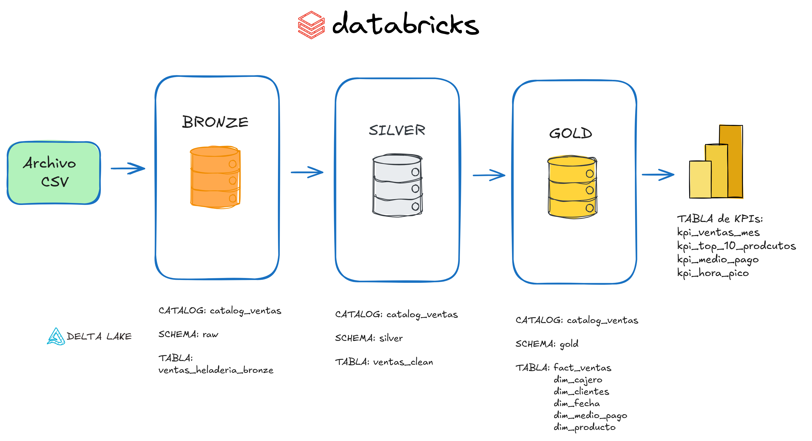
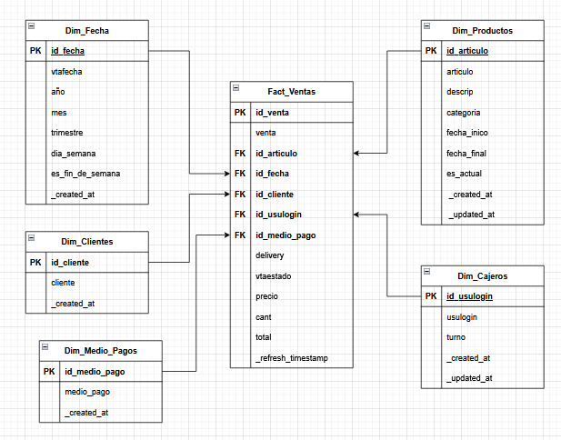

# 🍦 Proyecto Data Engineering – Pipeline de Ventas de Heladería - 6 meses | Databricks

## 📌 Descripción
Pipeline de datos **end-to-end** desarrollado en **Databricks** , orientado al análisis de ventas de una heladería, con el objetivo de estructurar mejor la informacion y poder analizar el negocio de una forma mas clara para la toma de decisiones.

El dataset comprende 6 meses de transacciones, sobre los cuales se implementó una arquitectura analítica basada en el enfoque **Medallion (Bronze–Silver–Gold)** con **orquestacion automatizada**, permitiendo transformar datos crudos en un **modelo dimensional Star Schema** optimizado para análisis y visualización.

---

# 🏗️ Arquitectura

## 🔹 Medallion Architecture

### 🥉 Bronze
- Ingesta **append-only** desde un archivo CSV  
- Sin transformaciones  
- Tipado mayormente `STRING`  

### 🥈 Silver
En la etapa de transformación se aplicaron reglas de calidad y normalización para garantizar consistencia, integridad y confiabilidad del dataset antes de su modelado en Gold.

✨ **Limpieza y Normalización de Texto**

Se estandarizaron columnas de tipo string mediante:

- `Eliminación de tildes`
- `Eliminacion de espacios innecesarios`
- `Limpieza de caracteres especiales`
- `Convertir caracteres a minusculas`

Objetivo: evitar duplicados semánticos y mejorar consistencia analítica.

🚫 **Filtrado de Valores Inválidos**

Se excluyeron registros con valores inconsistentes detectados en el EDA:

- `precio <> 0.01`
- `total <> 0.01`

Estos valores representaban errores de carga o registros anulados.

⚠️ **Control de Nulos**

Se implementó validación de nulos en columnas no críticas, permitiendo:

- `Mantener registros válidos`
- `Evitar pérdida innecesaria de datos`
- `Controlar impacto en métricas agregadas`

Columnas críticas fueron validadas bajo reglas estrictas antes de cargar a Gold.

🔢 **Tipado de Columnas**

Se aplicó conversión explícita de tipos para garantizar consistencia estructural:

- `precio → INT`
- `total → INT`
- `vtafecha → TIMESTAMP`

Esto permitió optimizar almacenamiento en Delta Lake y mejorar performance en consultas analíticas.

🔁 **Eliminación de Duplicados**

Se eliminaron registros duplicados utilizando como clave primaria compuesta:

- `PK: (venta, artículo)`

Esta validación aseguró integridad transaccional en la tabla de hechos del modelo dimensional.
 
#### Derivación de columnas de negocio
Durante la etapa de transformación (capa Silver), se generaron variables categóricas derivadas a partir de atributos existentes, con el objetivo de enriquecer el modelo analítico y facilitar segmentaciones posteriores.

📌 **Variables Derivadas**

👤 **Cliente**

Clasificación basada en características del registro de venta:

- `socio`
- `no_socio`
- `gastronomico`

Permite segmentar comportamiento de compra y analizar recurrencia.

🌙 **Turno**

Derivado a partir de la columna vtafecha:

- `mañana`
- `noche`

Facilita el análisis de ventas por franja horaria.

💳 **Medio de Pago**

Normalización y categorización de formas de pago:

- `tarjeta`
- `qr`
- `efectivo`
- `múltiple opciones`
- `cancelado`

Se unificaron variantes textuales para evitar inconsistencias analíticas.

🍨 **Categoría de Producto**

Clasificación de productos en categorías comerciales para:

- `Agrupación analítica`
- `Simplificación de reportes`
- `Construcción de dimensiones en el modelo Gold`

### 🥇 Gold
- Modelo **Star Schema**  
- Tablas de hechos y dimensiones  
- Soprte SCD Type 2 en dim_producto
- KPIs agregados para análisis  

---

# 🧱 Modelo de Datos - Star Schema


---
# 🔄 Estrategia de Ingesta

- **Bronze:** append-only  
- **Silver:** procesamiento incremental  
- **Gold:** tablas agregadas y KPIs  

Pipeline **idempotente** y **reprocesable** desde Bronze.

---

# 📊 KPIs Generados

### Generales
- Facturación total  
- Total de tickets  
- Unidades vendidas  
- Ticket promedio  
- Unidades por ticket  

### Operativos
- % ventas delivery vs local  
- Facturación por canal  
- Mix de medios de pago  

### Producto
- Top 10 productos por facturación  

### Temporales
- Ventas mensuales  
- Horas pico  

---

# 🧮 Ejemplo KPI – Ventas Mensuales

```sql
CREATE OR REPLACE TABLE catalog_ventas.gold.kpi_ventas_mes
USING DELTA
COMMENT 'KPI Ventas mensuales'
AS
WITH base AS (
  SELECT
      fa.id_venta,
      fa.cant,
      fa.total,
      fa.delivery,
      fa.vtaestado,
      f.mes
  FROM catalog_ventas.gold.fact_ventas fa
  LEFT JOIN catalog_ventas.gold.dim_fecha f
         ON fa.id_fecha = f.id_fecha
  WHERE fa.vtaestado != 'anulado'
)

SELECT
    mes,
    COUNT(DISTINCT id_venta) AS total_tickets,
    SUM(total) / 100 AS facturacion,
    SUM(cant) AS unidades_vendidas,
    ROUND(SUM(total) / 100 / COUNT(DISTINCT id_venta),2) AS ticket_promedio,
    ROUND(SUM(cant) / COUNT(DISTINCT id_venta),2) AS unidades_por_ticket,

    ROUND(
      COUNT(DISTINCT CASE WHEN delivery = TRUE THEN id_venta END)
      * 100.0 / COUNT(DISTINCT id_venta),2
    ) AS pct_delivery,

    ROUND(SUM(CASE WHEN delivery = TRUE THEN total /100 ELSE 0 END),2) AS fact_delivery,
    ROUND(SUM(CASE WHEN delivery = FALSE THEN total /100 ELSE 0 END),2) AS fact_local,

    ROUND(
      SUM(CASE WHEN delivery = FALSE THEN total ELSE 0 END)
      * 100.0 / SUM(total),2
    ) AS pct_fact_local,

    ROUND(
      SUM(CASE WHEN delivery = TRUE THEN total ELSE 0 END)
      * 100.0 / SUM(total),2
    ) AS pct_fact_delivery,

    CURRENT_TIMESTAMP() AS _refresh_timestamp

FROM base
GROUP BY mes
ORDER BY mes
```
---
## 🚀 Orquestación

Implementada con **Databricks Workflows**:

- Implemente un **pipeline batch incremental con ejecución diaria a las 02:00 AM** 
- Ingesta Bronze  
- Transformación Silver  
- Carga de dimensiones (MERGE)  
- Carga de fact  


---

## 📈 Insights de Negocio

####💰 Evolución de facturación
- Crecimiento mensual: **5.3M → 285M** (mes 7 a 12)

#### 🛵 Canal de venta
- El delivery pierde participación: **21.14% → 11.73%**  
- El local concentra hasta **88.7%** en temporada alta  

#### 🍨 Mix de productos
- El **granel ( el helado de 1kg)** lidera en:
  - facturación  
  - tickets  
  - volumen  
- Bombones, palitos y tortas, familiares funcionan como **productos de impulso**    

#### 💳 Medios de pago (negocio bancarizado)
- Tarjeta: **37.60%**  
- QR: **27.05%**  
- Efectivo: **32.23%**  

#### ⏱️ Horas pico
- 16:00–18:00  
- 20:00–22:30  

#### 💤 Baja actividad
- 10:00–14:00  
- 00:00–02:00  

---

## 📁 Estructura del Repositorio

```text
data_proyect_ventas
├── sql
│   └── ddl
│       ├── bronze
│       │   └── ddl_ventas_bronze.sql
│       ├── silver
│       │   └── ddl_ventas_silver.sql
│       └── gold
│           ├── ddl_dim_fecha.sql
│           ├── ddl_dim_producto.sql
│           ├── ddl_dim_medio_pago.sql
│           ├── ddl_fact_ventas.sql
│           ├── ddl_kpi_ventas_mes.sql
│           ├── ddl_kpi_top_10_productos.sql
│           ├── ddl_kpi_medio_pagos.sql
│           └── ddl_kpi_hora_pico.sql
│
├── docs
│   ├── decisiones_tecnicas.md
│   └── modelo_star_schema.png
|   └── diagrama_arquitectura_medallion.png
|      
│
├── EDA
│   ├── 01_EDA_estructura_bronze
│   ├── 02_EDA_analisis_nulos_bronze
│   ├── 03_EDA_analisis_distribucion_bronze
│   ├── 04_EDA_problemas_calidad_bronze
│   ├── 05_EDA_estadisticas_descriptivas
│   ├── 06_EDA_avanzado
│   └── 07_EDA_resumen_dataset_bronze
│   └── view_EDA_diseño_tabla_silver
|   └── view_EDA_estadistica_bronze
|
└── ETL
    ├── bronze
    │   └── etl_load_ventas_bronze.py
    ├── silver
    │   ├── etl_ventas_silver.py
    │   └── etl_validacion_silver.py
    └── gold
        ├── elt_load_dim_fecha.py
        ├── elt_load_dim_producto.py
        ├── elt_load_dim_medio_pago.py
        ├── elt_load_fact_ventas.py
        ├── elt_kpi_ventas_mes.py
        ├── elt_kpi_top_10_productos.py
        ├── elt_kpi_medio_pagos.py
        └── elt_kpi_hora_pico.py
```
---

## 🎯 Objetivo

Construir un pipeline analítico escalable, incremental y trazable, aplicando buenas prácticas de modelado de datos y garantizar la calidad para tomar mejores decisiones de negocio.

## 👤 Autor

Proyecto desarrollado como práctica de Data Engineering aplicado a analítica de ventas.


### 🛠️ Stack principal

- Databricks   
- SQL  
- Data Modeling  
- ETL  
- Orquestacion Workflows
